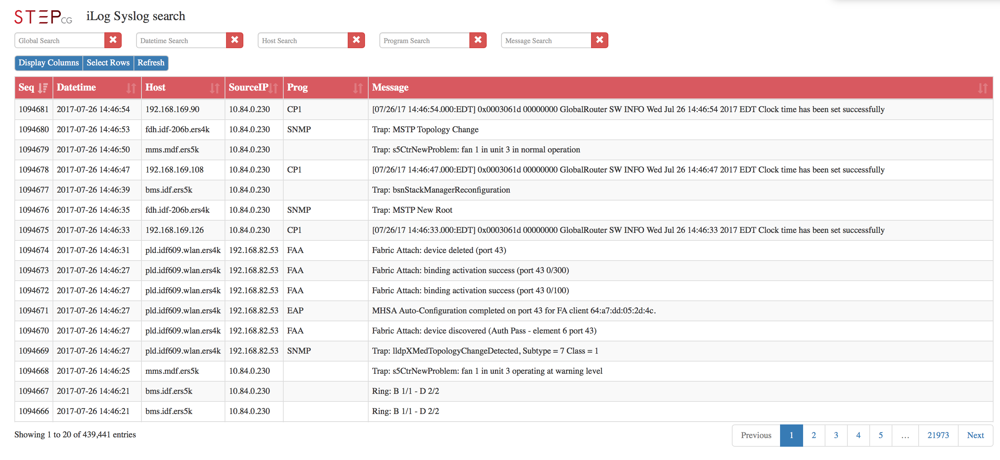

# ilog
This uses jquery, DataTables and Bootstrap to allow you to search a mysql database with syslog messages.  The search is very fast and uses server side processing.  I built a database and table for the logs.  I then used syslog-ng to send the logs to mysql database. 

To clone repository
<pre>
git clone https://github.com/ospfbgp/ilog
</pre>

  

